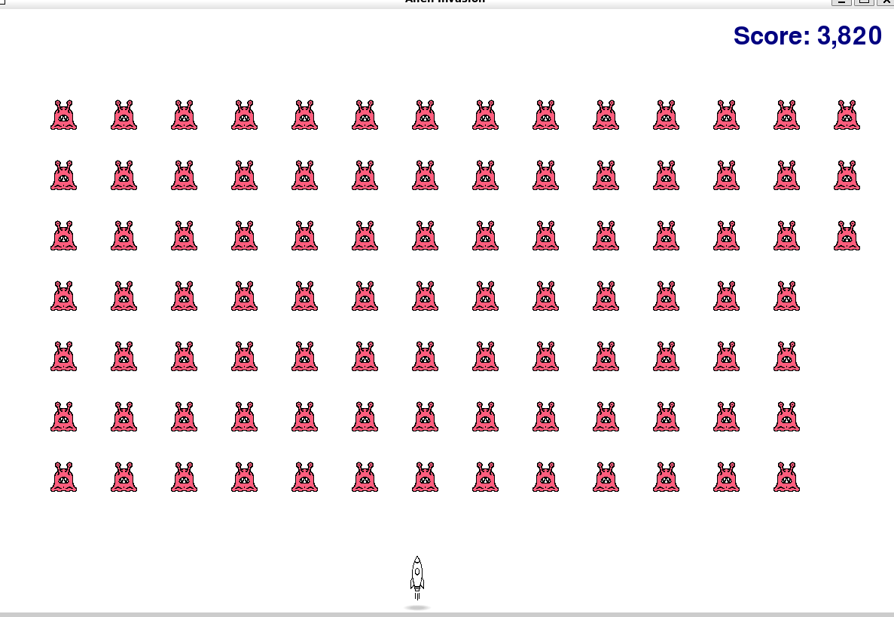
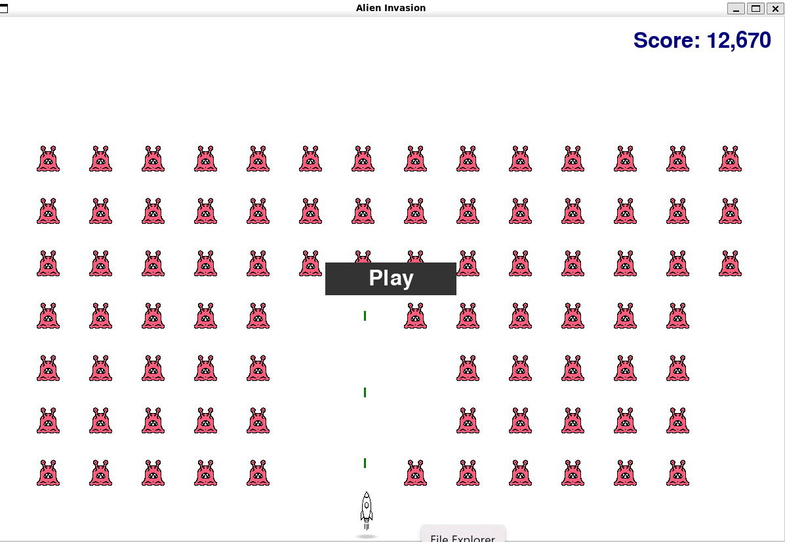

# 👾 Alien Invasion Game

A classic arcade-style shooter built with Python and Pygame, where you pilot a ship to defend Earth from waves of alien invaders.

---



## 🎮 How to Play

* Move your ship left and right using the arrow keys
* Press spacebar to shoot bullets
* Destroy all aliens before they reach the bottom to advance



---

## 🚀 Features

* Smooth controls and shooting
* Score tracking and game over conditions

---

## 🛠 Tech Stack

* Python 3.x
* Pygame

---

## 📥 Getting Started

```bash
git clone git@github.com:laurenda3/alien_invasion.git
cd alien_invasion
pip install pygame
python alien_invasion.py
```
